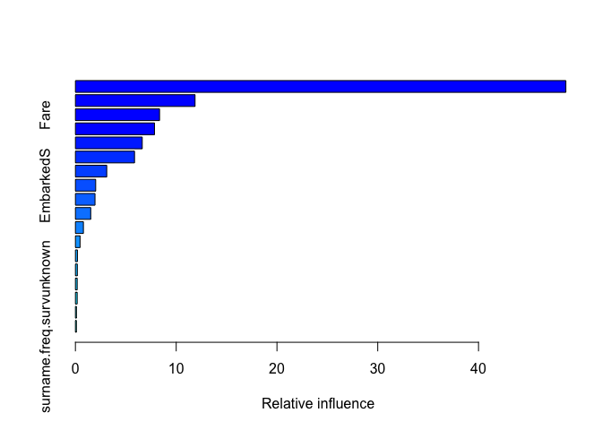
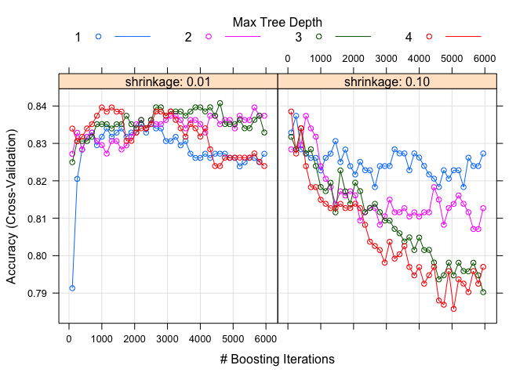
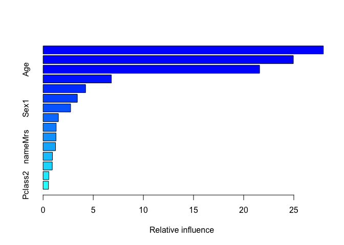

================
Titanic Survivor Classification Prediction
=================

Importing and Manipulating Data - Feature Engineering
-----------------

```r
library(dplyr)
```

```
## 
## Attaching package: 'dplyr'
```

```
## The following objects are masked from 'package:stats':
## 
##     filter, lag
```

```
## The following objects are masked from 'package:base':
## 
##     intersect, setdiff, setequal, union
```

```r
library(ggplot2)
```

```
## Registered S3 methods overwritten by 'ggplot2':
##   method         from 
##   [.quosures     rlang
##   c.quosures     rlang
##   print.quosures rlang
```

```r
library(rpart)
library(rpart.plot)
library(caret)
```

```
## Loading required package: lattice
```

```r
#train and test
train <- read.csv("Datasets/train.csv", stringsAsFactors = TRUE, na.strings = "")
test <- read.csv("Datasets/test.csv", stringsAsFactors = TRUE, na.strings = "")


#creating survived variables in test set and combinining train and test
test$Survived <- NA
dat <- rbind(train,test)
```

Survived and Pclass
--------------------

```r
#convert survived and pclass to factor variable
dat$Survived <- as.factor(dat$Survived)
dat$Pclass <- as.factor(dat$Pclass)
#Survived : 1 / no Survived : 0

#Bar graph for Pclass vs Survived
dat %>% filter(!is.na(Survived)) %>%
  ggplot(aes(x=Pclass, fill=Survived))+
  geom_bar()+
  geom_label(stat="count", 
             position=position_stack(0.5), 
             aes(label=..count..))+
  ggtitle("Pclass vs Survived")
```

<!-- -->

```r
#Bar graph for Sex vs Survived
dat %>% filter(!is.na(Survived)) %>%
  ggplot(aes(x=Sex, fill=Survived))+
  geom_bar()+
  geom_label(stat="count", 
             position=position_stack(0.5), 
             aes(label=..count..))+
  ggtitle("Sex vs Survived")
```

<!-- -->

```r
dat %>% filter(!is.na(Survived)) %>%
  ggplot(aes(x=Pclass, fill=Survived))+
  geom_bar()+
  geom_label(stat="count", 
             position=position_stack(0.5), 
             aes(label=..count..))+
  ggtitle("Pclass vs Survived by Sex")+
  facet_grid(~Sex)
```

<!-- -->

```r
#In Pclass 1 and 2, obviously male mostly not survived and female survived
#In Pclass 3, male mostly not survived, but female hard to predict whether surv or not
```

From Cabin, Cabin.ox
--------------------

```r
#Cabin NA values -> 0, otherwise 1
dat$Cabin.ox <- as.factor(ifelse(is.na(dat$Cabin), 0, 1))
table(dat$Cabin.ox)
```

```
## 
##    0    1 
## 1014  295
```

```r
#no cabin : 0 / cabin : 1

dat %>% filter(!is.na(Survived)) %>%
  ggplot(aes(x=Cabin.ox, fill=Survived))+
  geom_bar()+
  geom_label(stat="count", 
             position=position_stack(0.5), 
             aes(label=..count..))+
  ggtitle("Cabin.ox vs Survived")
```

<!-- -->

```r
dat %>% filter(!is.na(Survived)) %>%
  ggplot(aes(x=Cabin.ox, fill=Survived))+
  geom_bar()+
  geom_label(stat="count", 
             position=position_stack(0.5), 
             aes(label=..count..))+
  ggtitle("Cabin.ox vs Survived by Sex")+
  facet_grid(~Sex)
```

<!-- -->

```r
#If Cabin is not NA, then more likely survived
#no cabin likely not survived

dat %>% filter(!is.na(Survived)) %>%
  ggplot(aes(x=Cabin.ox, fill=Survived))+
  geom_bar()+
  geom_label(stat="count", 
             position=position_stack(0.5), 
             aes(label=..count..))+
  ggtitle("Cabin.ox vs Survived by Pclass")+
  facet_grid(~Pclass)
```

<!-- -->

```r
#Also, notice Pclass 1 people mostly have cabin
#Pclass 2 and 3 not

dat %>% filter(!is.na(Survived)) %>%
  ggplot(aes(x=Fare, fill=Cabin.ox))+
  geom_density(alpha=0.3)+
  ggtitle("Fare vs Cabin.ox")
```

<!-- -->

```r
dat %>% filter(!is.na(Survived)) %>%
  ggplot(aes(x=Cabin.ox, y=Fare))+
  geom_boxplot()+
  ggtitle("Fare vs Cabin.ox")
```

<!-- -->

```r
#Fare difference by Cabin.ox
```

Function to make prop.table
--------------------------

```r
#creating function to make prop.table

prop.func <- function(predictor){
  prop.tab <- data.frame(
    prop.table(
      matrix(
        c(table(dat[1:891,predictor], dat$Survived[1:891])[,1],
          table(dat[1:891,predictor], dat$Survived[1:891])[,2]),
        ncol=2),
      1))
  colnames(prop.tab) <- c("no surv", "surv")
  rownames(prop.tab) <- c(levels(dat[,predictor]))
  
  return(prop.tab)
}
```


From Cabin, deck.surv
-----------------

```r
#deck from Cabin
dat$deck <- as.factor(ifelse(is.na(substr(dat$Cabin,1,1)), "no", substr(dat$Cabin,1,1)))

which(dat$deck == "T") #the element where is in traing set.. lets replace this to something else
```

```
## [1] 340
```

```r
dat %>% 
  subset(select = -c(PassengerId)) %>% 
  filter(!is.na(Survived)) %>% 
  group_by(deck) %>% 
  summarise(count = n(),
            mean = mean(Fare))
```

```
## # A tibble: 9 x 3
##   deck  count  mean
##   <fct> <int> <dbl>
## 1 A        15  39.6
## 2 B        47 114. 
## 3 C        59 100. 
## 4 D        33  57.2
## 5 E        32  46.0
## 6 F        13  18.7
## 7 G         4  13.6
## 8 no      687  19.2
## 9 T         1  35.5
```

```r
#mean of Fare for deck "T" is close to the mean of Fare for deck "A" 
#replace "T" to "A"

dat$deck[dat$deck=="T"] <- "A"
dat$deck <- as.factor(as.character(dat$deck))

summary(dat$deck)
```

```
##    A    B    C    D    E    F    G   no 
##   23   65   94   46   41   21    5 1014
```

```r
#proportional bar graph 
dat %>% filter(!is.na(Survived)) %>%
  ggplot(aes(x=deck, fill=Survived))+
  geom_bar(position = "fill")+
  ggtitle("Deck Survival rate by Proportion")
```

<!-- -->

```r
#count bar graph without no deck
dat %>% filter(!is.na(Survived) & deck != "no") %>% 
  ggplot(aes(x=deck, fill=Survived)) + 
  geom_bar() + 
  geom_label(stat = "count", 
             position = position_stack(0.5), 
             aes(label= ..count..))+
  ggtitle("Deck Survival by count without no deck")
```

<!-- -->

```r
table(dat$deck[1:891], dat$Survived[1:891])
```

```
##     
##        0   1
##   A    9   7
##   B   12  35
##   C   24  35
##   D    8  25
##   E    8  24
##   F    5   8
##   G    2   2
##   no 481 206
```

```r
deck.prop <- prop.func("deck")

#proportional deck table
deck.prop
```

```
##      no surv      surv
## A  0.5625000 0.4375000
## B  0.2553191 0.7446809
## C  0.4067797 0.5932203
## D  0.2424242 0.7575758
## E  0.2500000 0.7500000
## F  0.3846154 0.6153846
## G  0.5000000 0.5000000
## no 0.7001456 0.2998544
```

```r
#we might want to group up B/D/E together (which have high prob for survived)
#so, B/C/D/E/F -> high prob surv rate deck
#    A/G/no -> low prob surv rate
dat$deck <- as.character(dat$deck)

dat$deck.surv <- NA
for(i in 1:nrow(dat)){
  if(dat$deck[i] %in% c("B", "C", "D", "E","F")){
    dat$deck.surv[i] <- "high"
  }
  if(dat$deck[i] %in% c("no", "A", "G")){
    dat$deck.surv[i] <- "low"
  }
}

table(dat$deck.surv)
```

```
## 
## high  low 
##  267 1042
```

```r
dat$deck.surv <- as.factor(dat$deck.surv)

dat <- dat %>% subset(select=-c(deck))
```


From Cabin, cabin.freq.surv
--------------------------

```r
#cabin frequency.. might have relationship between cabin freq
cabin.freq <- data.frame(table(dat$Cabin))


dat$cabin.freq <- NA
for(i in 1:nrow(dat)){
  if(dat$Cabin[i] %in% cabin.freq$Var1){
    dat$cabin.freq[i] <- cabin.freq$Freq[cabin.freq$Var1==dat$Cabin[i]]
  }
  else{
    dat$cabin.freq[i] <- 0
  }
}
dat$cabin.freq <- as.factor(dat$cabin.freq)
summary(dat$cabin.freq)
```

```
##    0    1    2    3    4    5    6 
## 1014  107  126   18   28   10    6
```

```r
#proportional bar graph
dat %>% filter(!is.na(Survived)) %>% 
  ggplot(aes(x=cabin.freq, fill=Survived)) + 
  geom_bar(position = "fill")+
  ggtitle("Cabin Frequency Survival Rate by Proportion")
```

<!-- -->

```r
#bar graph without no cabin
dat %>% filter(!is.na(Survived) & cabin.freq != 0) %>% 
  ggplot(aes(x=cabin.freq, fill=Survived)) + 
  geom_bar() + 
  geom_label(stat = "count", 
             position = position_stack(0.5), 
             aes(label= ..count..))+
  ggtitle("Cabin Frequency Survival by Count")
```

<!-- -->

```r
table(dat$cabin.freq[1:891], dat$Survived[1:891])
```

```
##    
##       0   1
##   0 481 206
##   1  36  39
##   2  21  68
##   3   2   8
##   4   5  15
##   5   2   4
##   6   2   2
```

```r
cabin.freq.prop <- prop.func("cabin.freq")


cabin.freq.prop
```

```
##     no surv      surv
## 0 0.7001456 0.2998544
## 1 0.4800000 0.5200000
## 2 0.2359551 0.7640449
## 3 0.2000000 0.8000000
## 4 0.2500000 0.7500000
## 5 0.3333333 0.6666667
## 6 0.5000000 0.5000000
```

```r
#no cabin barely survived
#cabin freq 1 / 2 / 3 / 4 / 5 more likely surv

#no cabin , cabin freq 6 -> low
#cabin freq 1,2,3,4,5    -> high

dat$cabin.freq.surv <- NA

for(i in 1:nrow(dat)){
  if(dat$cabin.freq[i] %in% c(1,2,3,4,5)){
    dat$cabin.freq.surv[i] <- "high"
  }
  if(dat$cabin.freq[i] %in% c(0,6)){
    dat$cabin.freq.surv[i] <- "low"
  }
}

dat$cabin.freq.surv <- as.factor(dat$cabin.freq.surv)
table(dat$cabin.freq.surv)
```

```
## 
## high  low 
##  289 1020
```

```r
dat <- subset(dat, select = -c(Cabin, cabin.freq))
```


Dealing with NA values in Embarked and Fare
--------------------------------

```r
#Gender -> male = 0, female = 1
dat$Sex <- as.factor(ifelse(dat$Sex == "male", 0, 1))

dat[is.na(dat$Embarked),]
```

```
##     PassengerId Survived Pclass                                      Name
## 62           62        1      1                       Icard, Miss. Amelie
## 830         830        1      1 Stone, Mrs. George Nelson (Martha Evelyn)
##     Sex Age SibSp Parch Ticket Fare Embarked Cabin.ox deck.surv
## 62    1  38     0     0 113572   80     <NA>        1      high
## 830   1  62     0     0 113572   80     <NA>        1      high
##     cabin.freq.surv
## 62             high
## 830            high
```

```r
#Pclass = 1 / Sex = Female / have cabin / 
#deck surv rate high / cabin freq surv rate high
dat %>% 
  filter(Pclass == 1 & 
           Sex == 1 & 
           Cabin.ox==1 & 
           deck.surv == "high" & 
           cabin.freq.surv == "high" & 
           SibSp == 0 & 
           Parch == 0) %>% group_by(Embarked) %>%
  summarise(count = n(),
            mean = mean(Fare),
            min = min(Fare),
            max = max(Fare))
```

```
## Warning: Factor `Embarked` contains implicit NA, consider using
## `forcats::fct_explicit_na`
```

```
## # A tibble: 3 x 5
##   Embarked count  mean   min   max
##   <fct>    <int> <dbl> <dbl> <dbl>
## 1 C           18  113.  27.7  262.
## 2 S           14  102.  25.9  222.
## 3 <NA>         2   80   80     80
```

```r
#Na value for Embarked
dat$Embarked[is.na(dat$Embarked)] <- "C"

dat[is.na(dat$Fare),]
```

```
##      PassengerId Survived Pclass               Name Sex  Age SibSp Parch
## 1044        1044     <NA>      3 Storey, Mr. Thomas   0 60.5     0     0
##      Ticket Fare Embarked Cabin.ox deck.surv cabin.freq.surv
## 1044   3701   NA        S        0       low             low
```

```r
summary(aov(Fare~Cabin.ox, dat))
```

```
##               Df  Sum Sq Mean Sq F value Pr(>F)    
## Cabin.ox       1  900931  900931   452.5 <2e-16 ***
## Residuals   1306 2600469    1991                   
## ---
## Signif. codes:  0 '***' 0.001 '**' 0.01 '*' 0.05 '.' 0.1 ' ' 1
## 1 observation deleted due to missingness
```

```r
summary(aov(Fare~Pclass, dat))
```

```
##               Df  Sum Sq Mean Sq F value Pr(>F)    
## Pclass         2 1272986  636493   372.7 <2e-16 ***
## Residuals   1305 2228414    1708                   
## ---
## Signif. codes:  0 '***' 0.001 '**' 0.01 '*' 0.05 '.' 0.1 ' ' 1
## 1 observation deleted due to missingness
```

```r
#NA value for Fare
dat[dat$Pclass == 3,] %>% 
  group_by(Embarked, Cabin.ox, Pclass) %>% 
  summarise(mean = mean(Fare, na.rm=TRUE))
```

```
## # A tibble: 6 x 4
## # Groups:   Embarked, Cabin.ox [6]
##   Embarked Cabin.ox Pclass  mean
##   <fct>    <fct>    <fct>  <dbl>
## 1 C        0        3      11.0 
## 2 C        1        3      12.3 
## 3 Q        0        3      10.4 
## 4 Q        1        3       7.75
## 5 S        0        3      14.5 
## 6 S        1        3      11.2
```

```r
#Pclass 3 / Embarked S / no cabin
#mean of Pclass 3 and Embarked S, and no cabin is 14.5

dat$Fare[is.na(dat$Fare)] <- 14.5
```


From Ticket, ticket.alone
--------------------------

```r
#Ticket
ticket.alone <- data.frame(table(dat$Ticket))

dat$ticket.alone <- NA
for(i in 1:nrow(dat)){
  if(dat$Ticket[i] %in% ticket.alone$Var1[ticket.alone$Freq==1]){
    dat$ticket.alone[i] <- 0
  }
  if(dat$Ticket[i] %in% ticket.alone$Var1[ticket.alone$Freq>1]){
    dat$ticket.alone[i] <- 1
  }
}

table(dat$ticket.alone)
```

```
## 
##   0   1 
## 713 596
```

```r
dat$ticket.alone <- as.factor(dat$ticket.alone)
```


From Ticket, ticket.let.surv
-------------------------

```r
#ticket by first letter
dat$ticket.let <- substr(dat$Ticket, 1,1)

ticket.let <- data.frame(table(dat$ticket.let))


#proportional bar graph
dat %>% filter(!is.na(Survived) ) %>% 
  ggplot(aes(x=ticket.let, fill=Survived)) + 
  geom_bar(position = "fill")+
  ggtitle("Ticket by first letter surv rate by proportional")
```

<!-- -->

```r
dat %>% filter(!is.na(Survived) ) %>% 
  ggplot(aes(x=ticket.let, fill=Survived)) + 
  geom_bar() + 
  geom_label(stat = "count", 
             position = position_stack(0.5), 
             aes(label= ..count..))+
  ggtitle("Ticket by first letter surv rate by count")
```

<!-- -->

```r
table(dat$ticket.let[1:891], dat$Survived[1:891])
```

```
##    
##       0   1
##   1  54  92
##   2  98  85
##   3 229  72
##   4   8   2
##   5   3   0
##   6   5   1
##   7   8   1
##   8   2   0
##   9   0   1
##   A  27   2
##   C  31  16
##   F   3   4
##   L   3   1
##   P  23  42
##   S  44  21
##   W  11   2
```

```r
dat$ticket.let <- as.factor(dat$ticket.let)

ticket.let.prop <- prop.func("ticket.let")
ticket.let.prop
```

```
##     no surv       surv
## 1 0.3698630 0.63013699
## 2 0.5355191 0.46448087
## 3 0.7607973 0.23920266
## 4 0.8000000 0.20000000
## 5 1.0000000 0.00000000
## 6 0.8333333 0.16666667
## 7 0.8888889 0.11111111
## 8 1.0000000 0.00000000
## 9 0.0000000 1.00000000
## A 0.9310345 0.06896552
## C 0.6595745 0.34042553
## F 0.4285714 0.57142857
## L 0.7500000 0.25000000
## P 0.3538462 0.64615385
## S 0.6769231 0.32307692
## W 0.8461538 0.15384615
```

```r
dat$ticket.let <- as.factor(dat$ticket.let)

die <- rownames(ticket.let.prop[ticket.let.prop$`no surv`>=0.5,])
surv <- rownames(ticket.let.prop[ticket.let.prop$`no surv`<0.5,])

dat$ticket.let <- as.character(dat$ticket.let)
dat$ticket.let.surv <- NA
for(i in 1:nrow(dat)){
  if(dat$ticket.let[i] %in% die){
    dat$ticket.let.surv[i] <- "low"
  }
  if(dat$ticket.let[i] %in% surv){
    dat$ticket.let.surv[i] <- "high"
  }
}

dat$ticket.let.surv <- as.factor(dat$ticket.let.surv)
summary(dat$ticket.let.surv)
```

```
## high  low 
##  323  986
```

```r
dat <- dat %>% subset(select =-c(Ticket, ticket.let))
```


Creating family variable
-----------------------

```r
#family size (if family = 1, then it's alone)
dat$family <- dat$SibSp + dat$Parch + 1
#1 == alone

dat <- subset(dat, select = -c(SibSp, Parch))
```


From Name, name and surname.freq.surv
Dealing with NA values in Age
---------------------------

```r
#converting names
dat <- dat %>% 
  mutate(name = sub("\\..*$", "", sub("^.*, ", "", Name)), 
         surname = sub(",.*$", "", Name))

summary(as.factor(dat$name))
```

```
##         Capt          Col          Don         Dona           Dr 
##            1            4            1            1            8 
##     Jonkheer         Lady        Major       Master         Miss 
##            1            1            2           61          260 
##         Mlle          Mme           Mr          Mrs           Ms 
##            2            1          757          197            2 
##          Rev          Sir the Countess 
##            8            1            1
```

```r
summary(as.factor(dat$surname))
```

```
##     Andersson          Sage       Asplund       Goodwin        Davies 
##            11            11             8             8             7 
##         Brown        Carter          Ford       Fortune       Johnson 
##             6             6             6             6             6 
##        Panula          Rice         Skoog         Smith         Kelly 
##             6             6             6             6             5 
##       Lefebre       Palsson       Ryerson        Thomas      Williams 
##             5             5             5             5             5 
##       Allison       Baclini        Becker        Boulos         Cacic 
##             4             4             4             4             4 
##          Dean         Elias     Goldsmith    Gustafsson        Hansen 
##             4             4             4             4             4 
##        Harper        Harris          Hart        Herman       Hocking 
##             4             4             4             4             4 
##     Johansson      Johnston       Laroche         Olsen Vander Planke 
##             4             4             4             4             4 
##          Ware          West        Abbott        Bourke      Caldwell 
##             4             4             3             3             3 
##      Carlsson       Chapman       Collyer       Compton           Cor 
##             3             3             3             3             3 
##        Coutts        Crosby          Daly        Danbom         Dodge 
##             3             3             3             3             3 
##       Douglas          Drew         Flynn    Frauenthal         Giles 
##             3             3             3             3             3 
##        Graham          Hays       Hickman        Howard          Hoyt 
##             3             3             3             3             3 
##        Jensen       Jussila      Karlsson         Keane Kink-Heilmann 
##             3             3             3             3             3 
##        Klasen        Mallet         McCoy         Meyer       Minahan 
##             3             3             3             3             3 
##         Moran      Moubarek        Murphy         Nakid      Navratil 
##             3             3             3             3             3 
##        Newell       Nilsson       O'Brien        Olsson     Oreskovic 
##             3             3             3             3             3 
##       Peacock         Peter      Phillips         Quick      Richards 
##             3             3             3             3             3 
##       Rosblom        Samaan     Sandstrom       Spedden      Svensson 
##             3             3             3             3             3 
##       Taussig        Thayer         Touma  van Billiard       (Other) 
##             3             3             3             3           921
```

```r
#name first

dat %>% 
  group_by(name, Sex) %>% 
  summarise(mean = mean(Age, na.rm=TRUE),
            min = min(Age, na.rm=TRUE),
            max = max(Age, na.rm=TRUE),
            count = n())
```

```
## # A tibble: 19 x 6
## # Groups:   name [18]
##    name         Sex    mean   min   max count
##    <chr>        <fct> <dbl> <dbl> <dbl> <int>
##  1 Capt         0     70    70     70       1
##  2 Col          0     54    47     60       4
##  3 Don          0     40    40     40       1
##  4 Dona         1     39    39     39       1
##  5 Dr           0     42.7  23     54       7
##  6 Dr           1     49    49     49       1
##  7 Jonkheer     0     38    38     38       1
##  8 Lady         1     48    48     48       1
##  9 Major        0     48.5  45     52       2
## 10 Master       0      5.48  0.33  14.5    61
## 11 Miss         1     21.8   0.17  63     260
## 12 Mlle         1     24    24     24       2
## 13 Mme          1     24    24     24       1
## 14 Mr           0     32.3  11     80     757
## 15 Mrs          1     37.0  14     76     197
## 16 Ms           1     28    28     28       2
## 17 Rev          0     41.2  27     57       8
## 18 Sir          0     49    49     49       1
## 19 the Countess 1     33    33     33       1
```

```r
#Master / Miss / Mr / Mrs
#Matser seems obvious young male
#Mr teenage to old male
#Miss and Mrs female in range young to old

#Age first.. to predict name by age

dat %>% filter(is.na(Age)) %>% group_by(name,Sex) %>% tally()
```

```
## # A tibble: 6 x 3
## # Groups:   name [6]
##   name   Sex       n
##   <chr>  <fct> <int>
## 1 Dr     0         1
## 2 Master 0         8
## 3 Miss   1        50
## 4 Mr     0       176
## 5 Mrs    1        27
## 6 Ms     1         1
```

```r
#dealing with Dr
dat %>% filter(name == "Dr")
```

```
##   PassengerId Survived Pclass                          Name Sex Age
## 1         246        0      1   Minahan, Dr. William Edward   0  44
## 2         318        0      2          Moraweck, Dr. Ernest   0  54
## 3         399        0      2              Pain, Dr. Alfred   0  23
## 4         633        1      1     Stahelin-Maeglin, Dr. Max   0  32
## 5         661        1      1 Frauenthal, Dr. Henry William   0  50
## 6         767        0      1     Brewe, Dr. Arthur Jackson   0  NA
## 7         797        1      1   Leader, Dr. Alice (Farnham)   1  49
## 8        1185     <NA>      1         Dodge, Dr. Washington   0  53
##       Fare Embarked Cabin.ox deck.surv cabin.freq.surv ticket.alone
## 1  90.0000        Q        1      high            high            1
## 2  14.0000        S        0       low             low            0
## 3  10.5000        S        0       low             low            0
## 4  30.5000        C        1      high            high            0
## 5 133.6500        S        0       low             low            1
## 6  39.6000        C        0       low             low            0
## 7  25.9292        S        1      high            high            0
## 8  81.8583        S        1       low            high            1
##   ticket.let.surv family name          surname
## 1            high      3   Dr          Minahan
## 2             low      1   Dr         Moraweck
## 3             low      1   Dr             Pain
## 4            high      1   Dr Stahelin-Maeglin
## 5            high      3   Dr       Frauenthal
## 6            high      1   Dr            Brewe
## 7            high      1   Dr           Leader
## 8             low      3   Dr            Dodge
```

```r
dat$Age[which(dat$name == "Dr" & is.na(dat$Age))] <- mean(dat$Age[which(dat$name == "Dr")], na.rm=TRUE)

#dealing with Ms
dat %>% filter(name == "Ms")
```

```
##   PassengerId Survived Pclass                      Name Sex Age  Fare
## 1         444        1      2 Reynaldo, Ms. Encarnacion   1  28 13.00
## 2         980     <NA>      3   O'Donoghue, Ms. Bridget   1  NA  7.75
##   Embarked Cabin.ox deck.surv cabin.freq.surv ticket.alone ticket.let.surv
## 1        S        0       low             low            0             low
## 2        Q        0       low             low            0             low
##   family name    surname
## 1      1   Ms   Reynaldo
## 2      1   Ms O'Donoghue
```

```r
dat$Age[which(dat$name == "Ms" & is.na(dat$Age))] <- mean(dat$Age[which(dat$name == "Ms")], na.rm=TRUE)

dat$name <- as.character(dat$name)
dat$surname <- as.character(dat$surname)


summary(aov(Age~Pclass, dat))
```

```
##               Df Sum Sq Mean Sq F value Pr(>F)    
## Pclass         2  37501   18750     109 <2e-16 ***
## Residuals   1045 179788     172                   
## ---
## Signif. codes:  0 '***' 0.001 '**' 0.01 '*' 0.05 '.' 0.1 ' ' 1
## 261 observations deleted due to missingness
```

```r
summary(aov(Age~name, dat))
```

```
##               Df Sum Sq Mean Sq F value Pr(>F)    
## name          17  65448    3850   26.11 <2e-16 ***
## Residuals   1030 151840     147                   
## ---
## Signif. codes:  0 '***' 0.001 '**' 0.01 '*' 0.05 '.' 0.1 ' ' 1
## 261 observations deleted due to missingness
```

```r
#I use Pclass and name to predict NA values in Age
#replacing NA's of Age with the mean by name and Pclass, respectively

dat %>% filter(is.na(Age)) %>% group_by(name,Pclass) %>% tally()
```

```
## # A tibble: 10 x 3
## # Groups:   name [4]
##    name   Pclass     n
##    <chr>  <fct>  <int>
##  1 Master 3          8
##  2 Miss   1          1
##  3 Miss   2          2
##  4 Miss   3         47
##  5 Mr     1         27
##  6 Mr     2         13
##  7 Mr     3        136
##  8 Mrs    1         10
##  9 Mrs    2          1
## 10 Mrs    3         16
```

```r
dat[dat$name %in% c("Mr", "Miss", "Mrs", "Master"),] %>% 
  group_by(name, Pclass) %>% 
  summarise(count = n(), 
            mean = mean(Age, na.rm=TRUE),
            min = min(Age, na.rm=TRUE),
            max = max(Age, na.rm=TRUE))
```

```
## # A tibble: 12 x 6
## # Groups:   name [4]
##    name   Pclass count  mean   min   max
##    <chr>  <fct>  <int> <dbl> <dbl> <dbl>
##  1 Master 1          5  6.98  0.92  13  
##  2 Master 2         11  2.76  0.67   8  
##  3 Master 3         45  6.09  0.33  14.5
##  4 Miss   1         60 30.3   2     63  
##  5 Miss   2         50 20.7   0.92  50  
##  6 Miss   3        150 17.4   0.17  45  
##  7 Mr     1        159 41.5  17     80  
##  8 Mr     2        150 32.3  14     70  
##  9 Mr     3        448 28.3  11     74  
## 10 Mrs    1         77 43.2  17     76  
## 11 Mrs    2         55 33.5  14     60  
## 12 Mrs    3         65 32.3  15     63
```

```r
for(i in 1:nrow(dat)){
  if(is.na(dat$Age[i])){
    #Master
    if(dat$name[i] == "Master" & dat$Pclass[i] == 3){
      dat$Age[i] <- mean(dat$Age[which(dat$name == "Master" & dat$Pclass == 3)], na.rm=TRUE)
    }
    
    #Miss
    if(dat$name[i] == "Miss" & dat$Pclass[i] == 1){
      dat$Age[i] <- mean(dat$Age[which(dat$name == "Miss" & dat$Pclass == 1)], na.rm=TRUE)
    }
    if(dat$name[i] == "Miss" & dat$Pclass[i] == 2){
      dat$Age[i] <- mean(dat$Age[which(dat$name == "Miss" & dat$Pclass == 2)], na.rm=TRUE)
    }
    if(dat$name[i] == "Miss" & dat$Pclass[i] == 3){
      dat$Age[i] <- mean(dat$Age[which(dat$name == "Miss" & dat$Pclass == 3)], na.rm=TRUE)
    }
    
    #Mr
    if(dat$name[i] == "Mr" & dat$Pclass[i] == 1){
      dat$Age[i] <- mean(dat$Age[which(dat$name == "Mr" & dat$Pclass == 1)], na.rm=TRUE)
    }
    if(dat$name[i] == "Mr" & dat$Pclass[i] == 2){
      dat$Age[i] <- mean(dat$Age[which(dat$name == "Mr" & dat$Pclass == 2)], na.rm=TRUE)
    }
    if(dat$name[i] == "Mr" & dat$Pclass[i] == 3){
      dat$Age[i] <- mean(dat$Age[which(dat$name == "Mr" & dat$Pclass == 3)], na.rm=TRUE)
    }
    
    #Mrs
    if(dat$name[i] == "Mrs" & dat$Pclass[i] == 1){
      dat$Age[i] <- mean(dat$Age[which(dat$name == "Mrs" & dat$Pclass == 1)], na.rm=TRUE)
    }
    if(dat$name[i] == "Mrs" & dat$Pclass[i] == 2){
      dat$Age[i] <- mean(dat$Age[which(dat$name == "Mrs" & dat$Pclass == 2)], na.rm=TRUE)
    }
    if(dat$name[i] == "Mrs" & dat$Pclass[i] == 3){
      dat$Age[i] <- mean(dat$Age[which(dat$name == "Mrs" & dat$Pclass == 3)], na.rm=TRUE)
    }
    
    #Ms
    if(dat$name[i] == "Ms" & dat$Pclass[i] == 3){
      dat$Age[i] <- mean(dat$Age[which(dat$name == "Ms" & dat$Pclass == 3)], na.rm=TRUE)
    }
  }
}


#dealing with other names
dat$name[!dat$name %in% c("Mr", "Miss", "Mrs", "Master") ]
```

```
##  [1] "Don"          "Rev"          "Rev"          "Dr"          
##  [5] "Rev"          "Dr"           "Mme"          "Dr"          
##  [9] "Ms"           "Major"        "Major"        "Lady"        
## [13] "Sir"          "Rev"          "Dr"           "Mlle"        
## [17] "Col"          "Dr"           "Col"          "Mlle"        
## [21] "Capt"         "the Countess" "Dr"           "Dr"          
## [25] "Jonkheer"     "Rev"          "Rev"          "Ms"          
## [29] "Col"          "Rev"          "Rev"          "Col"         
## [33] "Dr"           "Dona"
```

```r
dat %>% filter(!name %in% c("Mr", "Miss", "Mrs", "Master")) %>% 
  group_by(name, Sex) %>% 
  summarise(count = n(), 
            mean = mean(Age),
            min = min(Age, na.rm=TRUE),
            max = max(Age, na.rm=TRUE))
```

```
## # A tibble: 15 x 6
## # Groups:   name [14]
##    name         Sex   count  mean   min   max
##    <chr>        <fct> <int> <dbl> <dbl> <dbl>
##  1 Capt         0         1  70      70    70
##  2 Col          0         4  54      47    60
##  3 Don          0         1  40      40    40
##  4 Dona         1         1  39      39    39
##  5 Dr           0         7  42.8    23    54
##  6 Dr           1         1  49      49    49
##  7 Jonkheer     0         1  38      38    38
##  8 Lady         1         1  48      48    48
##  9 Major        0         2  48.5    45    52
## 10 Mlle         1         2  24      24    24
## 11 Mme          1         1  24      24    24
## 12 Ms           1         2  28      28    28
## 13 Rev          0         8  41.2    27    57
## 14 Sir          0         1  49      49    49
## 15 the Countess 1         1  33      33    33
```

```r
dat[dat$name %in% c("Mr", "Miss", "Mrs", "Master"),] %>% 
  group_by(name) %>% 
  summarise(count = n(), 
            mean = mean(Age, na.rm=TRUE),
            min = min(Age, na.rm=TRUE),
            max = max(Age, na.rm=TRUE))
```

```
## # A tibble: 4 x 5
##   name   count  mean   min   max
##   <chr>  <int> <dbl> <dbl> <dbl>
## 1 Master    61  5.56  0.33  14.5
## 2 Miss     260 21.0   0.17  63  
## 3 Mr       757 31.9  11     80  
## 4 Mrs      197 36.9  14     76
```

```r
#Master max age 14.5
#Master -> young male : sex==male & Age < 14.5
#Mr -> adult male :     sex==male & Age > 14.5
#Miss -> adult female : sex==female & Age < 14
#Mrs -> adult female :  sex==female & Age > 14

for(i in 1:nrow(dat)){
  if(!is.na(dat$Age[i])){
    if(!dat$name[i] %in% c("Mr", "Miss", "Mrs", "Master")){
      if(dat$Sex[i] == 0 & dat$Age[i] <= 14.5){
      dat$name[i] = "Master"
      }
      if(dat$Sex[i] == 0 & dat$Age[i] > 14.5){
      dat$name[i] <- "Mr"
      }
      if(dat$Sex[i] == 1 & dat$Age[i] < 14){
      dat$name[i] <- "Miss"
      }
      if(dat$Sex[i] == 1 & dat$Age[i] > 14){
      dat$name[i] <- "Mrs"
      }
    }
  }
}


dat$name <- as.factor(as.character(dat$name))

table(dat$name)
```

```
## 
## Master   Miss     Mr    Mrs 
##     61    260    782    206
```

```r
#surname frequency
surname.freq <- data.frame(table(dat$surname))

dat$surname.freq <-NA

for(i in 1:nrow(dat)){
  for(j in 1:11){
    if(dat$surname[i] %in% surname.freq$Var1[surname.freq$Freq == j]){
      dat$surname.freq[i] <- j
    }
  }
}

dat$surname.freq <- as.factor(dat$surname.freq)


#bar graph
dat %>% filter(!is.na(Survived)) %>% 
  ggplot(aes(x=surname.freq, fill=Survived)) + 
  geom_bar(position = "fill")+
  ggtitle("Surname Frequency Survival Rate by Proportion")
```

<!-- -->

```r
dat %>% filter(!is.na(Survived)) %>% 
  ggplot(aes(x=surname.freq, fill=Survived)) + 
  geom_bar() + 
  geom_label(stat = "count", position = position_stack(0.5), aes(label= ..count..))+
  ggtitle("Surname Frequency Survival by Count")
```

<!-- -->

```r
table(dat$surname.freq[1:891], dat$Survived[1:891])
```

```
##     
##        0   1
##   1  298 149
##   2   88  80
##   3   58  63
##   4   38  24
##   5   12   7
##   6   32  13
##   7    2   1
##   8    7   3
##   11  14   2
```

```r
surname.freq.prop <- prop.func("surname.freq")

surname.freq.prop
```

```
##      no surv      surv
## 1  0.6666667 0.3333333
## 2  0.5238095 0.4761905
## 3  0.4793388 0.5206612
## 4  0.6129032 0.3870968
## 5  0.6315789 0.3684211
## 6  0.7111111 0.2888889
## 7  0.6666667 0.3333333
## 8  0.7000000 0.3000000
## 11 0.8750000 0.1250000
```

```r
#notice that surname.freq 2,3 is likely hard to predict 
#however, more the surname.freq increased from 4 to 11, they are more likely not survived

#therefore, low surv rate -> 1,4,5,6,7,8,11
#unknown -> 2,3

dat$surname.freq <- as.character(dat$surname.freq)

dat$surname.freq.surv <- NA
for(i in 1:nrow(dat)){
  if(dat$surname.freq[i] %in% c(1,4,5,6,7,8,11)){
    dat$surname.freq.surv[i] <- "low"
  }
  if(dat$surname.freq[i] %in% c(2,3)){
    dat$surname.freq.surv[i] <- "unknown"
  }
}
dat$surname.freq.surv <- as.factor(dat$surname.freq.surv)

table(dat$surname.freq.surv)
```

```
## 
##     low unknown 
##     854     455
```

```r
dat <- subset(dat, select=-c(surname.freq, Name, surname))

summary(dat)
```

```
##   PassengerId   Survived   Pclass  Sex          Age       
##  Min.   :   1   0   :549   1:323   0:843   Min.   : 0.17  
##  1st Qu.: 328   1   :342   2:277   1:466   1st Qu.:21.00  
##  Median : 655   NA's:418   3:709           Median :28.32  
##  Mean   : 655                              Mean   :29.52  
##  3rd Qu.: 982                              3rd Qu.:36.50  
##  Max.   :1309                              Max.   :80.00  
##       Fare         Embarked Cabin.ox deck.surv   cabin.freq.surv
##  Min.   :  0.000   C:272    0:1014   high: 267   high: 289      
##  1st Qu.:  7.896   Q:123    1: 295   low :1042   low :1020      
##  Median : 14.454   S:914                                        
##  Mean   : 33.281                                                
##  3rd Qu.: 31.275                                                
##  Max.   :512.329                                                
##  ticket.alone ticket.let.surv     family           name    
##  0:713        high:323        Min.   : 1.000   Master: 61  
##  1:596        low :986        1st Qu.: 1.000   Miss  :260  
##                               Median : 1.000   Mr    :782  
##                               Mean   : 1.884   Mrs   :206  
##                               3rd Qu.: 2.000               
##                               Max.   :11.000               
##  surname.freq.surv
##  low    :854      
##  unknown:455      
##                   
##                   
##                   
## 
```


Investigating correlation or relationship between each variables in our dataset
-----------------------------

```r
#Let's see the correlation or relationship between each variables in our dataset

#factor vs factor - chisq test : null H0 = two factor variables are independent
#factor vs numeric - anova test : null H0 = at least one factor has different mean than others
#numeric vs numeric - correlation : linear relationship between vars, 
#more than 0.5 means they have some relationship to each other

relationship.test <- function(variables, dummy.data, data){

  for(i in variables){
    for(j in variables){
      
      #factor vs factor : chisq.test
      if(is.factor(data[,i])){
        if(is.factor(data[,j])){
          dummy.data[dummy.data$cols == i,j] <- round(chisq.test(data[,i], data[,j])$p.value,3)
          }
      }
      
      #factor vs numeric : anova
      if(is.factor(data[,i])){
        if(is.numeric(data[,j])){
          dummy.data[dummy.data$cols == i,j] <-
            round(summary(aov(data[,j]~data[,i]))[[1]][["Pr(>F)"]][[1]],3)
          }
      }
      if(is.numeric(data[,i])){
        if(is.factor(data[,j])){
          dummy.data[dummy.data$cols == i,j] <- 
            round(summary(aov(data[,i]~data[,j]))[[1]][["Pr(>F)"]][[1]],3)
          }
        }
    
      #numeric vs numeric : correlation
      if(is.numeric(data[,i])){
        if(is.numeric(data[,j])){
          dummy.data[dummy.data$cols == i,j] <- round(cor(data[,i], data[,j]),3)
          }
        }
    }
  }
  
  return(dummy.data)
}

#creating variables
variables <- colnames(dat)[2:ncol(dat)]

#dummy data
test.data <- data.frame(cols = variables)

data.pval <- relationship.test(variables, test.data, dat)
```

```
## Warning in chisq.test(data[, i], data[, j]): Chi-squared approximation may
## be incorrect
```

```r
data.pval
```

```
##                 cols Survived Pclass   Sex    Age  Fare Embarked Cabin.ox
## 1           Survived    0.000  0.000 0.000  0.031 0.000    0.000    0.000
## 2             Pclass    0.000  0.000 0.000  0.000 0.000    0.000    0.000
## 3                Sex    0.000  0.000 0.000  0.002 0.000    0.000    0.000
## 4                Age    0.031  0.000 0.002  1.000 0.190    0.000    0.000
## 5               Fare    0.000  0.000 0.000  0.190 1.000    0.000    0.000
## 6           Embarked    0.000  0.000 0.000  0.000 0.000    0.000    0.000
## 7           Cabin.ox    0.000  0.000 0.000  0.000 0.000    0.000    0.000
## 8          deck.surv    0.000  0.000 0.000  0.000 0.000    0.000    0.000
## 9    cabin.freq.surv    0.000  0.000 0.000  0.000 0.000    0.000    0.000
## 10      ticket.alone    0.000  0.000 0.000  0.007 0.000    0.000    0.000
## 11   ticket.let.surv    0.000  0.000 0.000  0.000 0.000    0.000    0.000
## 12            family    0.620  0.102 0.000 -0.224 0.227    0.001    0.609
## 13              name    0.000  0.000 0.000  0.000 0.000    0.000    0.000
## 14 surname.freq.surv    0.000  0.000 0.000  0.753 0.000    0.001    0.000
##    deck.surv cabin.freq.surv ticket.alone ticket.let.surv family name
## 1      0.000           0.000        0.000           0.000  0.620    0
## 2      0.000           0.000        0.000           0.000  0.102    0
## 3      0.000           0.000        0.000           0.000  0.000    0
## 4      0.000           0.000        0.007           0.000 -0.224    0
## 5      0.000           0.000        0.000           0.000  0.227    0
## 6      0.000           0.000        0.000           0.000  0.001    0
## 7      0.000           0.000        0.000           0.000  0.609    0
## 8      0.000           0.000        0.000           0.000  0.386    0
## 9      0.000           0.000        0.000           0.000  0.601    0
## 10     0.000           0.000        0.000           0.000  0.000    0
## 11     0.000           0.000        0.000           0.000  0.085    0
## 12     0.386           0.601        0.000           0.085  1.000    0
## 13     0.000           0.000        0.000           0.000  0.000    0
## 14     0.000           0.000        0.000           0.014  0.037    0
##    surname.freq.surv
## 1              0.000
## 2              0.000
## 3              0.000
## 4              0.753
## 5              0.000
## 6              0.001
## 7              0.000
## 8              0.000
## 9              0.000
## 10             0.000
## 11             0.014
## 12             0.037
## 13             0.000
## 14             0.000
```

```r
#factor vs factor : if <0.05 (p value), highly dependent, if not, independent
#factor vs numeric : if <0.05, at least one factor has different mean than others. 
#if not, all factor has similar mean (non linear)
#numeric vs numeric : if <0.5, low correlation, if not, high correlation
```


Creating familyGroup from investigation of relationship between each variables
----------------------------

```r
#Lets make family to be better predictor

tr <- rpart(Survived~family, dat)
tr
```

```
## n=891 (418 observations deleted due to missingness)
## 
## node), split, n, loss, yval, (yprob)
##       * denotes terminal node
## 
## 1) root 891 342 0 (0.6161616 0.3838384)  
##   2) family< 1.5 537 163 0 (0.6964618 0.3035382) *
##   3) family>=1.5 354 175 1 (0.4943503 0.5056497)  
##     6) family>=4.5 62  10 0 (0.8387097 0.1612903) *
##     7) family< 4.5 292 123 1 (0.4212329 0.5787671) *
```

```r
rpart.plot(tr)
```

<!-- -->

```r
dat %>% filter(!is.na(Survived)) %>% 
  ggplot(aes(x=family, fill=Survived))+
  geom_density(alpha = 0.3)+
  geom_vline(xintercept=c(1.5, 4.5))
```

<!-- -->

```r
#1.5 and 4.5

dat$familyGroup <- as.factor(ifelse(dat$family < 1.5, "alone",
                                    ifelse(dat$family > 1.5 & dat$family < 4.5, "small fam", "large fam")))

table(dat$familyGroup)
```

```
## 
##     alone large fam small fam 
##       790        82       437
```

```r
variables <- colnames(dat)[2:ncol(dat)]
test.data <- data.frame(cols = variables)
test.data
```

```
##                 cols
## 1           Survived
## 2             Pclass
## 3                Sex
## 4                Age
## 5               Fare
## 6           Embarked
## 7           Cabin.ox
## 8          deck.surv
## 9    cabin.freq.surv
## 10      ticket.alone
## 11   ticket.let.surv
## 12            family
## 13              name
## 14 surname.freq.surv
## 15       familyGroup
```

```r
data.pval <- relationship.test(variables, test.data, dat)
```

```
## Warning in chisq.test(data[, i], data[, j]): Chi-squared approximation may
## be incorrect

## Warning in chisq.test(data[, i], data[, j]): Chi-squared approximation may
## be incorrect

## Warning in chisq.test(data[, i], data[, j]): Chi-squared approximation may
## be incorrect
```

```r
data.pval[,1:2]
```

```
##                 cols Survived
## 1           Survived    0.000
## 2             Pclass    0.000
## 3                Sex    0.000
## 4                Age    0.031
## 5               Fare    0.000
## 6           Embarked    0.000
## 7           Cabin.ox    0.000
## 8          deck.surv    0.000
## 9    cabin.freq.surv    0.000
## 10      ticket.alone    0.000
## 11   ticket.let.surv    0.000
## 12            family    0.620
## 13              name    0.000
## 14 surname.freq.surv    0.000
## 15       familyGroup    0.000
```

```r
dat <- dat %>% subset(select=-c(PassengerId, family))

summary(dat)
```

```
##  Survived   Pclass  Sex          Age             Fare         Embarked
##  0   :549   1:323   0:843   Min.   : 0.17   Min.   :  0.000   C:272   
##  1   :342   2:277   1:466   1st Qu.:21.00   1st Qu.:  7.896   Q:123   
##  NA's:418   3:709           Median :28.32   Median : 14.454   S:914   
##                             Mean   :29.52   Mean   : 33.281           
##                             3rd Qu.:36.50   3rd Qu.: 31.275           
##                             Max.   :80.00   Max.   :512.329           
##  Cabin.ox deck.surv   cabin.freq.surv ticket.alone ticket.let.surv
##  0:1014   high: 267   high: 289       0:713        high:323       
##  1: 295   low :1042   low :1020       1:596        low :986       
##                                                                   
##                                                                   
##                                                                   
##                                                                   
##      name     surname.freq.surv    familyGroup 
##  Master: 61   low    :854       alone    :790  
##  Miss  :260   unknown:455       large fam: 82  
##  Mr    :782                     small fam:437  
##  Mrs   :206                                    
##                                                
## 
```

Splitting train and test set to start modeling
-----------------------------------------

```r
#train / test
training <- dat %>% filter(!is.na(Survived))
testing <- dat %>% filter(is.na(Survived))

summary(training)
```

```
##  Survived Pclass  Sex          Age             Fare        Embarked
##  0:549    1:216   0:577   Min.   : 0.42   Min.   :  0.00   C:170   
##  1:342    2:184   1:314   1st Qu.:21.00   1st Qu.:  7.91   Q: 77   
##           3:491           Median :28.32   Median : 14.45   S:644   
##                           Mean   :29.43   Mean   : 32.20           
##                           3rd Qu.:36.75   3rd Qu.: 31.00           
##                           Max.   :80.00   Max.   :512.33           
##  Cabin.ox deck.surv  cabin.freq.surv ticket.alone ticket.let.surv
##  0:687    high:184   high:200        0:481        high:219       
##  1:204    low :707   low :691        1:410        low :672       
##                                                                  
##                                                                  
##                                                                  
##                                                                  
##      name     surname.freq.surv    familyGroup 
##  Master: 40   low    :602       alone    :537  
##  Miss  :182   unknown:289       large fam: 62  
##  Mr    :537                     small fam:292  
##  Mrs   :132                                    
##                                                
## 
```

```r
summary(testing)
```

```
##  Survived   Pclass  Sex          Age             Fare         Embarked
##  0   :  0   1:107   0:266   Min.   : 0.17   Min.   :  0.000   C:102   
##  1   :  0   2: 93   1:152   1st Qu.:22.00   1st Qu.:  7.896   Q: 46   
##  NA's:418   3:218           Median :28.32   Median : 14.454   S:270   
##                             Mean   :29.70   Mean   : 35.577           
##                             3rd Qu.:36.38   3rd Qu.: 31.472           
##                             Max.   :76.00   Max.   :512.329           
##  Cabin.ox deck.surv  cabin.freq.surv ticket.alone ticket.let.surv
##  0:327    high: 83   high: 89        0:232        high:104       
##  1: 91    low :335   low :329        1:186        low :314       
##                                                                  
##                                                                  
##                                                                  
##                                                                  
##      name     surname.freq.surv    familyGroup 
##  Master: 21   low    :252       alone    :253  
##  Miss  : 78   unknown:166       large fam: 20  
##  Mr    :245                     small fam:145  
##  Mrs   : 74                                    
##                                                
## 
```

```r
#we have 14 predictors. 
#we might want to remove some predictors that have low importance while modeling
```

From Cabin..
  - Cabin.ox : Cabin NA = 0 or Cabin = 1
  - deck.surv : extract the first letter of cabin, with the probability of survival for the deck, splitted into 2 groups, which are high / low
  - cabin.freq.surv : 2 groups by surv rate with cabin frequency

from Ticket..
  - ticket.alone : unique ticket = 0 other 1
  - ticket.let.surv : with the first letter of ticket, splitted into 2 groups by surv rate of the ticket letter

from Name..
  - name : Master / Miss / Mr / Mrs
  - surname.freq.surv : groups by surv rate with surname frequency


Caret - Cross Validation
Creating useful function for modeling
---------------------

```r
#creating function for Caret modeling

model <- function(method, training, control,grid,...){

  if(is.null(grid)){
    model.fit <- train(Survived~.,
                     data = training,
                     method = method,
                     trControl = control,
                     ...)
    return(model.fit)
  }

  else{
    model.fit <- train(Survived~.,
                     data = training,
                     method = method,
                     trControl = control,
                     tuneGrid = grid,
                     ...)
    return(model.fit)
  }
}

#accuracy of model
acc <- function(pred, act, data){
  return(sum(diag(table(pred, act)))/nrow(data))
}

#10 folds cv
control <- trainControl(method = "cv", number = 10)
```


I will use Random Forest / Gradient Boosting Method / Support Vector Machine with kernel radial


Random Forest
-------------

```r
#typical mtry in classification = sqrt(# of predictors)
rf.fit <- train(Survived~., data = training,
                method="rf", trControl = control, 
                ntree=500, importance = TRUE, 
                tuneGrid = expand.grid(mtry = round(sqrt(ncol(training)-1))))

rf.fit
```

```
## Random Forest 
## 
## 891 samples
##  13 predictor
##   2 classes: '0', '1' 
## 
## No pre-processing
## Resampling: Cross-Validated (10 fold) 
## Summary of sample sizes: 802, 802, 803, 802, 801, 801, ... 
## Resampling results:
## 
##   Accuracy   Kappa    
##   0.8182474  0.6075437
## 
## Tuning parameter 'mtry' was held constant at a value of 4
```

```r
plot(rf.fit$finalModel)
```

<!-- -->

```r
varImp(rf.fit)
```

```
## rf variable importance
## 
##                          Importance
## nameMr                      100.000
## Pclass3                      66.163
## Sex1                         64.517
## Fare                         61.645
## Age                          60.947
## familyGrouplarge fam         50.708
## familyGroupsmall fam         37.715
## Pclass2                      34.909
## nameMrs                      31.568
## nameMiss                     31.041
## EmbarkedS                    27.911
## ticket.alone1                27.467
## ticket.let.survlow           27.388
## cabin.freq.survlow           24.648
## deck.survlow                 22.626
## Cabin.ox1                    20.367
## EmbarkedQ                     9.629
## surname.freq.survunknown      0.000
```

```r
rf.fit.result <- data.frame(rf.fit$finalModel$importance[,"MeanDecreaseAccuracy"])
colnames(rf.fit.result) <- "MeanDecreaseAccuracy"

rf.fit.result
```

```
##                          MeanDecreaseAccuracy
## Pclass2                          0.0085827396
## Pclass3                          0.0335891685
## Sex1                             0.0563148190
## Age                              0.0207257881
## Fare                             0.0325058534
## EmbarkedQ                        0.0025949871
## EmbarkedS                        0.0059801942
## Cabin.ox1                        0.0070780460
## deck.survlow                     0.0084061091
## cabin.freq.survlow               0.0083890433
## ticket.alone1                    0.0086186914
## ticket.let.survlow               0.0069567839
## nameMiss                         0.0133131042
## nameMr                           0.1078443171
## nameMrs                          0.0134119894
## surname.freq.survunknown         0.0009762423
## familyGrouplarge fam             0.0145835764
## familyGroupsmall fam             0.0105625502
```

```r
rf.fit.result %>% mutate(name = rownames(rf.fit.result)) %>% 
  arrange(MeanDecreaseAccuracy) %>%
  ggplot(aes(x=reorder(name, MeanDecreaseAccuracy),y=MeanDecreaseAccuracy))+
  geom_point()+
  theme(axis.text.x = element_text(angle=90))
```

<!-- -->

```r
#remove Embarked / surname.freq.surv 


#tuning parameter mtry and ntree by cross validation
#typical mtry is sqrt(# of predictor)
#ntree: in small dataset -> 100 in large dataset -> 500~1000 sufficient
#larger ntree is more stable, but takes long time
rf.grid <- expand.grid(mtry = seq(2,10, by=2))

rf.acc <- data.frame(ntree = seq(100,1000, by=100), minacc = NA, acc = NA)

for(i in seq(100, 1000, by=100)){
  rf.fit <- train(Survived~., data=training %>% subset(select = -c(Embarked, surname.freq.surv)),
                  method = "rf", trControl = control, 
                  ntree=i, tuneGrid = rf.grid, importance = TRUE)
  rf.acc[rf.acc$ntree == i,2] <- max(rf.fit$results$Accuracy) -
    rf.fit$results$AccuracySD[which.max(rf.fit$results$Accuracy)]
  rf.acc[rf.acc$ntree == i,3] <- max(rf.fit$results$Accuracy)
}

rf.acc
```

```
##    ntree    minacc       acc
## 1    100 0.7789998 0.8316809
## 2    200 0.8030001 0.8317075
## 3    300 0.7891940 0.8317305
## 4    400 0.7899621 0.8328178
## 5    500 0.7832890 0.8381980
## 6    600 0.8026394 0.8372863
## 7    700 0.8046779 0.8394206
## 8    800 0.7905028 0.8350153
## 9    900 0.8027371 0.8338285
## 10  1000 0.7797470 0.8325911
```

```r
ggplot(rf.acc, aes(x=ntree, y=acc))+
  geom_line()+
  geom_point()
```

<!-- -->

```r
g.ntree <- rf.acc$ntree[which.max(rf.acc$minacc)]
g.ntree
```

```
## [1] 700
```

```r
#I will choose the ntree that has maximum value of minacc = max accuracy - accuracy sd

rf.model <- train(Survived~., 
                  data=training %>% subset(select=-c(Embarked, surname.freq.surv)), 
                  method = "rf", trControl = control, 
                  ntree=g.ntree, tuneGrid = rf.grid, importance=TRUE)

rf.model
```

```
## Random Forest 
## 
## 891 samples
##  11 predictor
##   2 classes: '0', '1' 
## 
## No pre-processing
## Resampling: Cross-Validated (10 fold) 
## Summary of sample sizes: 802, 802, 801, 802, 802, 802, ... 
## Resampling results across tuning parameters:
## 
##   mtry  Accuracy   Kappa    
##    2    0.8350133  0.6446094
##    4    0.8350638  0.6455874
##    6    0.8328169  0.6403525
##    8    0.8317189  0.6394667
##   10    0.8272245  0.6303538
## 
## Accuracy was used to select the optimal model using the largest value.
## The final value used for the model was mtry = 4.
```

```r
plot(rf.model$finalModel)
```

<!-- -->

```r
max(rf.model$results$Accuracy)
```

```
## [1] 0.8350638
```

```r
#about 83%

varImp(rf.model)
```

```
## rf variable importance
## 
##                      Importance
## nameMr                  100.000
## Pclass3                  53.147
## familyGrouplarge fam     42.684
## Fare                     42.391
## Age                      41.950
## Sex1                     38.592
## Pclass2                  14.062
## familyGroupsmall fam     11.242
## ticket.let.survlow        7.523
## nameMrs                   6.741
## ticket.alone1             5.970
## nameMiss                  5.817
## Cabin.ox1                 3.582
## deck.survlow              1.700
## cabin.freq.survlow        0.000
```

```r
rf.model.result <- data.frame(rf.model$finalModel$importance[,"MeanDecreaseAccuracy"])
colnames(rf.model.result) <- "MeanDecreaseAccuracy"

rf.model.result
```

```
##                      MeanDecreaseAccuracy
## Pclass2                       0.007468228
## Pclass3                       0.035112336
## Sex1                          0.053636568
## Age                           0.020506518
## Fare                          0.032401358
## Cabin.ox1                     0.007646188
## deck.survlow                  0.007654550
## cabin.freq.survlow            0.007169034
## ticket.alone1                 0.007392427
## ticket.let.survlow            0.006702971
## nameMiss                      0.013055155
## nameMr                        0.128091439
## nameMrs                       0.011833768
## familyGrouplarge fam          0.017699086
## familyGroupsmall fam          0.008224047
```

```r
rf.model.result %>% mutate(name = rownames(rf.model.result)) %>% 
  arrange(MeanDecreaseAccuracy) %>%
  ggplot(aes(x=reorder(name, MeanDecreaseAccuracy),y=MeanDecreaseAccuracy))+
  geom_point()+
  theme(axis.text.x = element_text(angle=90))
```

<!-- -->

```r
rf.minacc <- max(rf.model$results$Accuracy) - 
  rf.model$results$AccuracySD[which.max(rf.model$results$Accuracy)] 
rf.minacc
```

```
## [1] 0.8054741
```

```r
#about 80%

#predict on real test
rf.pred <- predict(rf.model, training)

confusionMatrix(rf.pred, training$Survived)
```

```
## Confusion Matrix and Statistics
## 
##           Reference
## Prediction   0   1
##          0 517  60
##          1  32 282
##                                           
##                Accuracy : 0.8967          
##                  95% CI : (0.8749, 0.9159)
##     No Information Rate : 0.6162          
##     P-Value [Acc > NIR] : < 2.2e-16       
##                                           
##                   Kappa : 0.7783          
##                                           
##  Mcnemar's Test P-Value : 0.004879        
##                                           
##             Sensitivity : 0.9417          
##             Specificity : 0.8246          
##          Pos Pred Value : 0.8960          
##          Neg Pred Value : 0.8981          
##              Prevalence : 0.6162          
##          Detection Rate : 0.5802          
##    Detection Prevalence : 0.6476          
##       Balanced Accuracy : 0.8831          
##                                           
##        'Positive' Class : 0               
## 
```

```r
#93.15%

#training accuracy - cv accuracy
acc(rf.pred, training$Survived, training) - max(rf.model$results$Accuracy)
```

```
## [1] 0.06168139
```

```r
#0.0987
```


Gradient Boosting Method
-------------


```r
#modeling without tuning parameter
boost.model <- train(Survived~.,
                   data = training,
                   method = "gbm",
                   verbose = FALSE,
                   trControl = control,
                   tuneGrid = NULL)

boost.model
```

```
## Stochastic Gradient Boosting 
## 
## 891 samples
##  13 predictor
##   2 classes: '0', '1' 
## 
## No pre-processing
## Resampling: Cross-Validated (10 fold) 
## Summary of sample sizes: 802, 802, 801, 802, 803, 801, ... 
## Resampling results across tuning parameters:
## 
##   interaction.depth  n.trees  Accuracy   Kappa    
##   1                   50      0.8271612  0.6258544
##   1                  100      0.8316181  0.6408772
##   1                  150      0.8293962  0.6367130
##   2                   50      0.8260254  0.6273526
##   2                  100      0.8305323  0.6372972
##   2                  150      0.8339158  0.6429117
##   3                   50      0.8237779  0.6198172
##   3                  100      0.8350519  0.6464192
##   3                  150      0.8417436  0.6603437
## 
## Tuning parameter 'shrinkage' was held constant at a value of 0.1
## 
## Tuning parameter 'n.minobsinnode' was held constant at a value of 10
## Accuracy was used to select the optimal model using the largest value.
## The final values used for the model were n.trees = 150,
##  interaction.depth = 3, shrinkage = 0.1 and n.minobsinnode = 10.
```

```r
summary(boost.model$finalModel)
```

<!-- -->

```
##                                               var    rel.inf
## nameMr                                     nameMr 33.2287663
## Fare                                         Fare 17.2272165
## Age                                           Age 13.2360294
## Pclass3                                   Pclass3 10.0997809
## Sex1                                         Sex1  7.5496851
## familyGrouplarge fam         familyGrouplarge fam  5.2496587
## ticket.let.survlow             ticket.let.survlow  4.4213782
## cabin.freq.survlow             cabin.freq.survlow  2.3017294
## deck.survlow                         deck.survlow  1.4557399
## EmbarkedS                               EmbarkedS  1.3415635
## nameMrs                                   nameMrs  0.7696190
## surname.freq.survunknown surname.freq.survunknown  0.7655215
## familyGroupsmall fam         familyGroupsmall fam  0.5986570
## ticket.alone1                       ticket.alone1  0.4600072
## nameMiss                                 nameMiss  0.4262335
## EmbarkedQ                               EmbarkedQ  0.3850393
## Cabin.ox1                               Cabin.ox1  0.3786218
## Pclass2                                   Pclass2  0.1047528
```

```r
#surname.freq.surv / Embarked


#Grid Search
#I put relatively large value of shrinkage to prevent overfitting
boost.grid <- expand.grid(n.trees = seq(100,6000, by=150),
                          interaction.depth = c(1,2,3,4),
                          shrinkage = c(0.01,0.1),
                          n.minobsinnode = c(10))

#modeling
boost.model <- train(Survived~.,
                   data = training %>% 
                     subset(select = -c(Embarked, surname.freq.surv)),
                   method = "gbm",
                   verbose = FALSE,
                   trControl = control,
                   tuneGrid = boost.grid)

boost.model$bestTune
```

```
##     n.trees interaction.depth shrinkage n.minobsinnode
## 127    1000                 4      0.01             10
```

```r
max(boost.model$results$Accuracy) 
```

```
## [1] 0.8450562
```

```r
#84.44%

boost.minacc <- max(boost.model$results$Accuracy) - 
  boost.model$results$AccuracySD[which.max(boost.model$results$Accuracy)] 
boost.minacc
```

```
## [1] 0.8094128
```

```r
#81.28%

plot(boost.model)
```

<!-- -->

```r
summary(boost.model$finalModel)
```

<!-- -->

```
##                                       var    rel.inf
## nameMr                             nameMr 38.7420073
## Fare                                 Fare 18.0417347
## Age                                   Age 13.8857902
## Pclass3                           Pclass3 10.4105019
## familyGrouplarge fam familyGrouplarge fam  5.3350612
## ticket.let.survlow     ticket.let.survlow  4.4841955
## Sex1                                 Sex1  2.1534019
## cabin.freq.survlow     cabin.freq.survlow  2.1121157
## deck.survlow                 deck.survlow  1.3815172
## nameMrs                           nameMrs  0.9007157
## familyGroupsmall fam familyGroupsmall fam  0.8870651
## Cabin.ox1                       Cabin.ox1  0.5593556
## nameMiss                         nameMiss  0.5046801
## ticket.alone1               ticket.alone1  0.4805465
## Pclass2                           Pclass2  0.1213116
```

```r
boost.model$finalModel$tuneValue$n.trees
```

```
## [1] 1000
```

```r
#predict on training
boost.pred <- predict(boost.model, training, 
                      n.trees=boost.model$finalModel$tuneValue$n.trees)


confusionMatrix(boost.pred, training$Survived)
```

```
## Confusion Matrix and Statistics
## 
##           Reference
## Prediction   0   1
##          0 511  67
##          1  38 275
##                                           
##                Accuracy : 0.8822          
##                  95% CI : (0.8591, 0.9026)
##     No Information Rate : 0.6162          
##     P-Value [Acc > NIR] : < 2.2e-16       
##                                           
##                   Kappa : 0.7468          
##                                           
##  Mcnemar's Test P-Value : 0.006285        
##                                           
##             Sensitivity : 0.9308          
##             Specificity : 0.8041          
##          Pos Pred Value : 0.8841          
##          Neg Pred Value : 0.8786          
##              Prevalence : 0.6162          
##          Detection Rate : 0.5735          
##    Detection Prevalence : 0.6487          
##       Balanced Accuracy : 0.8674          
##                                           
##        'Positive' Class : 0               
## 
```

```r
#88.78%

acc(boost.pred, training$Survived, training) - max(boost.model$results$Accuracy)
```

```
## [1] 0.0370987
```

```r
#0.0437
```


SVM - kernel radial
-------------------


```r
svm.radial <- model("svmRadial", training, control, grid = NULL, tuneLength = 10)
svm.radial 
```

```
## Support Vector Machines with Radial Basis Function Kernel 
## 
## 891 samples
##  13 predictor
##   2 classes: '0', '1' 
## 
## No pre-processing
## Resampling: Cross-Validated (10 fold) 
## Summary of sample sizes: 801, 802, 802, 802, 803, 801, ... 
## Resampling results across tuning parameters:
## 
##   C       Accuracy   Kappa    
##     0.25  0.8327673  0.6402420
##     0.50  0.8271493  0.6251978
##     1.00  0.8304824  0.6308762
##     2.00  0.8260129  0.6216020
##     4.00  0.8103198  0.5913297
##     8.00  0.8125417  0.5962433
##    16.00  0.8024668  0.5746465
##    32.00  0.7979977  0.5655580
##    64.00  0.7946394  0.5586370
##   128.00  0.8013687  0.5730793
## 
## Tuning parameter 'sigma' was held constant at a value of 0.05626913
## Accuracy was used to select the optimal model using the largest value.
## The final values used for the model were sigma = 0.05626913 and C = 0.25.
```

```r
max(svm.radial$results$Accuracy)
```

```
## [1] 0.8327673
```

```r
#83.16%

varImp(svm.radial)
```

```
## ROC curve variable importance
## 
##                   Importance
## Sex                  100.000
## Fare                  68.444
## Pclass                63.925
## Cabin.ox              45.132
## cabin.freq.surv       44.666
## deck.surv             43.806
## ticket.let.surv       42.370
## ticket.alone          42.056
## familyGroup           39.028
## Embarked              20.071
## surname.freq.surv     19.463
## Age                    1.246
## name                   0.000
```

```r
#name and Age

#Grid Search for tuning parameter
svm.grid <- expand.grid(sigma = seq(0.01,0.1, by=0.01),
                        C = seq(0.01,2.01,by=0.25))

svm.radial <- model("svmRadial", training %>% subset(select = -c(name, Age)), 
                    control, 
                    grid = svm.grid)

svm.radial$bestTune
```

```
##   sigma    C
## 5  0.01 1.01
```

```r
max(svm.radial$results$Accuracy)
```

```
## [1] 0.8103967
```

```r
#0.8160

#on training
svm.radial.pred <- predict(svm.radial, training)

confusionMatrix(svm.radial.pred, training$Survived)
```

```
## Confusion Matrix and Statistics
## 
##           Reference
## Prediction   0   1
##          0 492 112
##          1  57 230
##                                          
##                Accuracy : 0.8103         
##                  95% CI : (0.783, 0.8356)
##     No Information Rate : 0.6162         
##     P-Value [Acc > NIR] : < 2.2e-16      
##                                          
##                   Kappa : 0.5865         
##                                          
##  Mcnemar's Test P-Value : 3.269e-05      
##                                          
##             Sensitivity : 0.8962         
##             Specificity : 0.6725         
##          Pos Pred Value : 0.8146         
##          Neg Pred Value : 0.8014         
##              Prevalence : 0.6162         
##          Detection Rate : 0.5522         
##    Detection Prevalence : 0.6779         
##       Balanced Accuracy : 0.7843         
##                                          
##        'Positive' Class : 0              
## 
```

```r
#0.8395

acc(svm.radial.pred, training$Survived, training) - max(svm.radial$results$Accuracy)
```

```
## [1] -7.118627e-05
```

```r
#0.0235
```


Ensembling models in a dataset
-------------

```r
#prediction on test

rf.test.pred <- predict(rf.model, testing)
boost.test.pred <- predict(boost.model, testing)
svm.radial.pred <- predict(svm.radial, testing)

ensembled.test <- data.frame(PassengerId = test$PassengerId, 
                             rf = rf.test.pred, 
                             boost= boost.test.pred, 
                             svm = svm.radial.pred)

#Take average of the predicting value by 3 models : Random Forest / Gradient Boosting / SVM - Radial
ensembled.test$mean <- as.factor(round((as.numeric(ensembled.test$rf) + 
                                          as.numeric(ensembled.test$boost) + 
                                          as.numeric(ensembled.test$svm) - 3)/3))

ensembled.test$PassengerId <- as.character(ensembled.test$PassengerId)

summary(ensembled.test)
```

```
##  PassengerId        rf      boost   svm     mean   
##  Length:418         0:261   0:258   0:271   0:260  
##  Class :character   1:157   1:160   1:147   1:158  
##  Mode  :character
```


Creating submission
--------------

```r
final.pred <- ensembled.test$mean
final.pred
```

```
##   [1] 0 0 0 0 1 0 1 0 1 0 0 0 1 0 1 1 0 0 1 1 0 1 1 0 1 0 1 0 0 0 0 0 1 1 1
##  [36] 0 1 0 0 0 0 1 0 1 1 0 0 0 1 1 1 0 1 1 0 0 0 0 0 1 0 0 0 1 1 1 1 0 0 1
##  [71] 1 0 1 1 1 0 0 1 0 1 1 0 0 0 0 0 1 0 1 1 1 0 1 0 0 0 1 0 1 0 1 0 0 0 1
## [106] 0 0 0 0 0 0 1 1 1 1 0 0 1 0 1 1 0 1 0 0 1 0 1 0 0 0 0 0 0 0 0 0 0 0 0
## [141] 0 1 0 0 0 0 0 0 0 0 1 0 0 1 0 0 1 1 1 1 1 1 1 0 0 1 0 0 1 0 0 0 0 0 0
## [176] 1 1 0 1 1 0 0 1 0 1 0 1 0 0 0 0 0 1 0 1 0 1 1 0 1 1 1 0 1 0 0 1 0 1 0
## [211] 0 0 0 1 0 0 1 0 1 0 1 0 1 0 1 1 0 1 0 0 0 1 0 0 0 0 0 0 1 1 1 1 0 0 1
## [246] 0 1 0 1 0 1 0 0 0 0 0 0 0 1 0 0 0 1 1 0 0 0 0 1 0 0 0 1 1 0 1 0 0 0 0
## [281] 0 1 1 1 1 0 0 0 0 0 0 1 0 0 0 0 1 0 0 0 0 0 0 0 1 1 0 1 0 0 0 0 0 0 1
## [316] 1 0 0 0 0 0 0 0 0 1 0 1 0 0 0 1 0 0 1 0 1 0 0 0 1 0 0 0 1 1 1 0 1 0 1
## [351] 1 0 0 0 1 0 1 0 0 1 0 1 1 0 1 0 0 0 1 0 0 1 0 0 1 1 0 0 0 0 0 0 1 1 0
## [386] 1 0 0 0 0 0 1 1 0 0 1 0 1 0 0 1 0 1 0 0 0 0 0 1 1 1 1 1 0 1 0 0 1
## Levels: 0 1
```

```r
final <- data.frame(PassengerId = test$PassengerId, Survived = final.pred)

head(final)
```

```
##   PassengerId Survived
## 1         892        0
## 2         893        0
## 3         894        0
## 4         895        0
## 5         896        1
## 6         897        0
```

```r
#write.csv(final, "/Users/DavidKwon/Desktop/Practice/Kaggle/Titanic/final.csv", row.names = FALSE)
```

Public Score - The public score is different by seed, but it's about 78~79%


